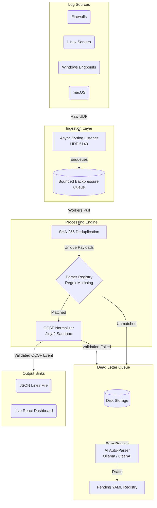

# Universal Log Pre-processing Framework (ULPF) — Architecture

## 1. System Overview

The ULPF is a high-throughput, vendor-agnostic ingestion and normalization pipeline designed for modern cybersecurity operations (SIH26156). It sits between perimeter network devices (Firewalls, IDS, OS logs) and the target SIEM/Data Lake.

Its primary responsibility is to accept heterogeneous log formats, extract relevant fields using zero-code YAML parsers, rigorously normalize them into the **OCSF v1.3** schema, and emit them in a unified format, all while preserving strict forensic chain-of-custody.

## 2. High-Level Architecture Diagram

## 3. Component Details

### 3.1 Ingestion Layer & Queue
Network devices forward logs via standard Syslog (RFC 5424 / RFC 3164) over UDP to the `asyncio` listener. To prevent memory exhaustion during log spikes or DDoS attacks, logs are immediately placed into a bounded, backpressured `asyncio.Queue`.

### 3.2 Parser Engine & Normalization
The core engine pulls events from the queue and routes them through a priority-sorted list of active parsers.
1. **Deduplication:** A time-windowed SHA-256 cache prevents duplicate processing of the same exact log.
2. **Matching:** Pre-compiled regex patterns identify the source system.
3. **Normalization:** Named capture groups are passed into a hardened Jinja2 `SandboxedEnvironment`. The parser's `field_mappings` instruct the engine on how to cast types and map values into the OCSF ontology.
4. **Validation:** The resulting dictionary is passed to strict `Pydantic v2` models (`BaseEvent`, `Authentication`, `NetworkActivity`). If validation fails, the event is rejected to the DLQ.

### 3.3 Lossless Forensic Envelope
Unlike traditional SIEM forwarders that mutate or truncate logs, ULPF strictly preserves the exact original byte sequence. Every OCSF event emitted contains:
- `raw_data`: The original payload.
- `raw_data_hash`: A SHA-256 fingerprint computed *before* any string decoding or parsing occurs.

### 3.4 The Dead Letter Queue (DLQ) & AI Auto-Healing
Events that do not match any known parser, or fail strict OCSF validation, are never dropped. They are written to the DLQ.
Based on the `ULPF_DLQ_MODE` strategy, the pipeline can route unmatched logs to an LLM (local Ollama or OpenAI). The LLM analyzes the raw log and generates a draft YAML parser, saving it to `parsers/pending/`. 

**Human-in-the-Loop (HITL):** For security, AI-generated parsers are never automatically activated. A SOC analyst must review the file and manually move it to `parsers/active/`.

### 3.5 Output Sinks
Validated events are pushed to pluggable output sinks. The default `jsonl` sink appends the OCSF events to rotating files ready for ingestion by Elasticsearch, Splunk HEC, or Kafka. The pipeline also exposes a `/history` HTTP endpoint for the real-time React dashboard.

## 4. Security & Performance Model
- **Zero-Code:** Arbitrary Python execution is eliminated. Parsers are declarative YAML.
- **Sandboxed Rendering:** Jinja2 templates are strictly jailed. `__class__` and `__import__` access is explicitly denied to prevent Server-Side Template Injection (SSTI).
- **Secrets Management:** No credentials in code. API keys are injected exclusively via environment variables.
- **Performance:** `uvloop` (on Unix) powers the asynchronous reactor, regexes are pre-compiled at boot, and an adjustable worker pool scales to utilize multiple CPU cores for high-EPS environments.
